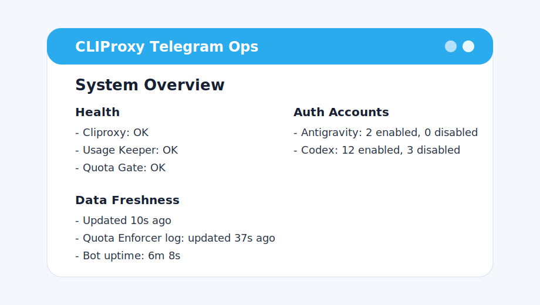
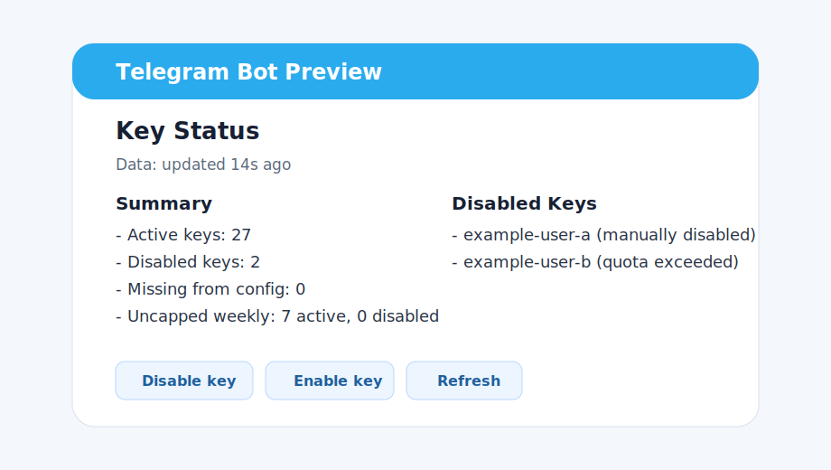

# CLIProxy Telegram Ops

[](https://github.com/kyhoavuong/cliproxy-telegram-ops/actions/workflows/ci.yml)
[](https://github.com/kyhoavuong/cliproxy-telegram-ops/actions/workflows/docker-publish.yml)
[](LICENSE)
[](#docker-images)

Open-source operations helpers for a CLIProxyAPI stack: quota self-checks, quota enforcement helpers, usage-aware Telegram alerts, and Docker Compose examples for running the stack from published images.

This repository is a sanitized open-source distribution of the helper services and tests used around a CLIProxyAPI operations stack. It does not include private runtime state, auth files, API keys, usage databases, production nginx configuration, or incident/audit history.

## Related Projects

This project is designed to run alongside:

- [CLIProxyAPI](https://github.com/router-for-me/CLIProxyAPI): the upstream OpenAI-compatible proxy server.
- [CPA Usage Keeper](https://github.com/Willxup/cpa-usage-keeper): usage persistence, quota cache, and usage analytics for CLIProxyAPI.

`cliproxy-telegram-ops` adds Telegram operator workflows, quota enforcement helpers, health alerts, and public Docker Compose examples around that stack.

## Preview

Example Telegram operator views:

| System overview | Key status |
| --- | --- |
|  |  |

## What Is Included

- `quota-gate`: an `aiohttp` helper service for quota health and self-check endpoints.
- `telegram-alerts`: a Telegram bot for operator workflows, health alerts, GPT pool capacity views, quota views, usage summaries, key management, and verified change notifications.
- `quota-enforcer`: a host-run Python helper for quota-based API key disable/restore flows and protected key-state cleanup.
- `compose.public.yaml`: a portable Docker Compose example that pulls published images.
- `.env.example` and `config/config.example.yaml`: placeholder-only setup examples.
- Unit tests for Telegram UX, alert lifecycle, change-watch behavior, and quota-enforcer parsing.

## Behavior Highlights

- GPT pool capacity treats Plus-compatible Team and Edu quota windows as usable capacity, while true Free/non-Plus rows are excluded and alerted.
- Manual API-key disable/enable/delete flows mutate state first, then emit one verified system notification after the change is observed.
- Quota-disabled, manually-disabled, deleted, and active states are modeled separately so stale manual markers do not create false Enable options or duplicate alerts.
- Telegram callback paths use scoped picker state, secret-safe labels, fast cache paths, and narrow refreshes for responsive mobile operation.

## Docker Images

GitHub Actions publishes helper images to GHCR:

```text
ghcr.io/kyhoavuong/cliproxy-telegram-ops-quota-gate:latest
ghcr.io/kyhoavuong/cliproxy-telegram-ops-alerts:latest
ghcr.io/kyhoavuong/cliproxy-telegram-ops-quota-gate:v0.1.0
ghcr.io/kyhoavuong/cliproxy-telegram-ops-alerts:v0.1.0
```

The compose file also uses upstream images:

```text
eceasy/cli-proxy-api:v7.2.4
ghcr.io/willxup/cpa-usage-keeper:v1.10.7
cloudflare/cloudflared:latest
```

## Releases

Stable release tags are published on GitHub and GHCR. See [v0.1.0](https://github.com/kyhoavuong/cliproxy-telegram-ops/releases/tag/v0.1.0).

## Quickstart

See [docs/DOCKER_QUICKSTART.md](docs/DOCKER_QUICKSTART.md).

For a system-level overview, see [docs/ARCHITECTURE.md](docs/ARCHITECTURE.md).

For a concise case-study summary, see [docs/PROJECT_HIGHLIGHTS.md](docs/PROJECT_HIGHLIGHTS.md).

Short version:

```bash
git clone https://github.com/kyhoavuong/cliproxy-telegram-ops.git
cd cliproxy-telegram-ops

cp .env.example .env
cp config/config.example.yaml config/config.yaml
mkdir -p data/auth logs quota-enforcer usage-keeper telegram-alerts/state

printf '{\n  "timezone": "Asia/Ho_Chi_Minh",\n  "dry_run": false,\n  "keys": []\n}\n' > quota-enforcer/quotas.json
printf '{}\n' > quota-enforcer/state.json

docker compose -f compose.public.yaml up -d cliproxy usage-keeper quota-gate
```

Edit `.env` and `config/config.yaml` before using the stack for real traffic.

After setting Telegram values in `.env`, start the operator bot:

```bash
docker compose -f compose.public.yaml --profile alerts up -d telegram-alerts
```

## Development

Run the full local verification suite:

```bash
scripts/check.sh
```

Run only Telegram alert tests:

```bash
PYTHONPATH=telegram-alerts/src python3 -m unittest discover -s telegram-alerts/tests -v
```

Validate the public compose file:

```bash
env CPA_MANAGEMENT_KEY=example USAGE_KEEPER_PASSWORD=example CLOUDFLARED_TOKEN=example \
  docker compose -f compose.public.yaml config
```

Build helper images locally:

```bash
docker build -t cliproxy-telegram-ops-quota-gate ./quota-gate
docker build -t cliproxy-telegram-ops-alerts ./telegram-alerts
```

## Security

Do not commit:

- `.env`
- `config/config.yaml`
- `data/auth/*`
- `quota-enforcer/quotas.json`
- `quota-enforcer/state.json`
- `usage-keeper/*`
- `telegram-alerts/state/*`
- logs, databases, backups, or OAuth/auth JSON files

The checked-in examples are placeholders only. Review your CLIProxyAPI upstream configuration and provider terms before using this stack.

## License

MIT. See [LICENSE](LICENSE).
