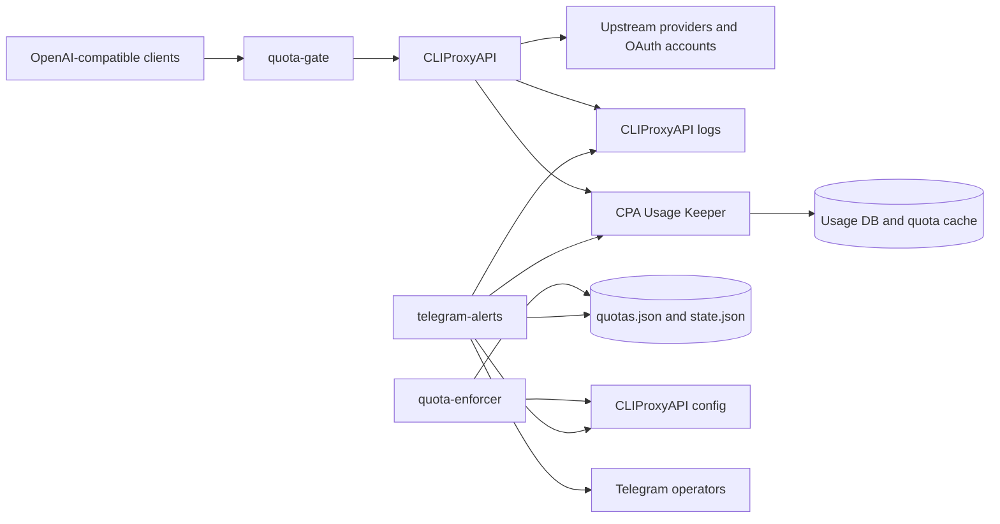

# Architecture

`cliproxy-telegram-ops` is an operations layer around a CLIProxyAPI deployment. It does not replace CLIProxyAPI or CPA Usage Keeper; it connects them with Telegram workflows, quota guardrails, and operator-friendly status views.

## System Map

## Components

### CLIProxyAPI

CLIProxyAPI is the upstream proxy server. It serves OpenAI-compatible API traffic and owns provider/auth configuration.

### CPA Usage Keeper

CPA Usage Keeper stores request usage, quota cache data, and usage analytics. The Telegram bot reads this data for usage reports, quota summaries, and fast operator views.

### quota-gate

`quota-gate` is a small `aiohttp` service that sits in front of CLIProxyAPI for quota-aware health and self-check behavior. It reads quota state and Usage Keeper data, then exposes lightweight endpoints for operations checks.

### quota-enforcer

`quota-enforcer` is a host-run Python helper that disables or restores API keys according to quota state. It writes runtime quota files such as `quota-enforcer/quotas.json` and `quota-enforcer/state.json`; those files are intentionally ignored by Git.

### telegram-alerts

`telegram-alerts` is the operator interface. It sends health alerts, shows quota and usage views, supports key management workflows, and watches for real configuration changes before broadcasting change notifications.

## Data And State Boundaries

- Public source code and examples live in Git.
- Runtime secrets stay local in `.env`, `config/config.yaml`, `data/auth/*`, Usage Keeper data, Telegram state, logs, and quota state.
- The public Docker Compose file is intentionally generic and does not include production nginx, Cloudflare account details, private domains, backups, or incident history.

## Notification Model

Operator actions use a confirmation step before mutating runtime state. Automatic change notifications are emitted only after the system observes the real state change. Matching bot-confirmed changes use a fast verification path so the notification is timely without sending duplicates.

## Testing Strategy

The repository keeps most behavior testable with Python standard-library tests:

- Telegram UX and callback flows.
- Health alert rendering and secret-safe labels.
- Change-watch lifecycle and duplicate suppression.
- Quota-enforcer config parsing and state transitions.
- Public Docker Compose validation in CI.
